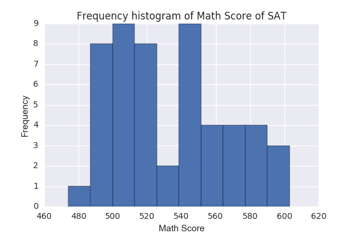
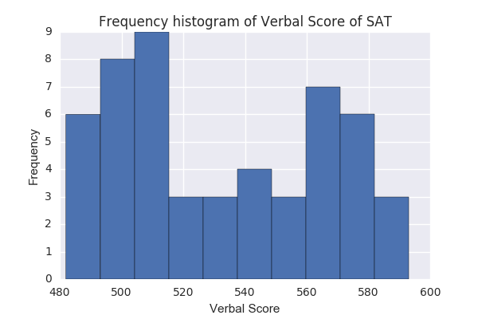
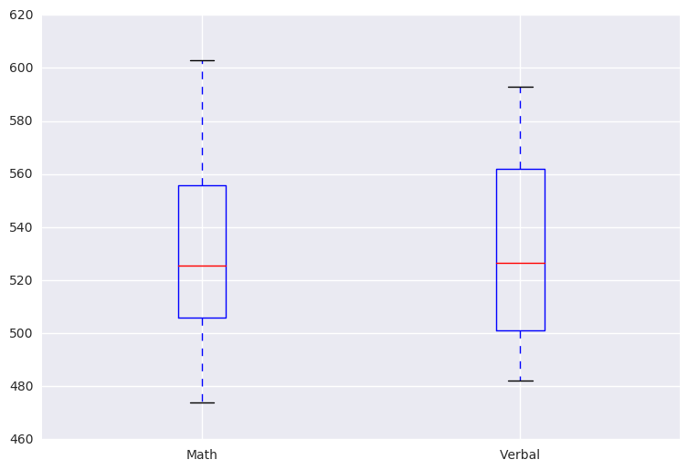

Title: SAT scores and trends across US states in 2001
Date: 2017-01-02 10:20
Category: Project

# SAT scores and trends across US states in 2001

I was working with a small data set of SAT scores and rates of participation across states in 2001 and found some interesting insights.

The dataset contained four columns (variables) and 52 rows (observations) including 50 states, DC and an entry called All which assumed to be some kind of population weighted average of the scores and rates among all states.


## Investigating the data.

Using few pandas commands, 
``` python
print(data.tail())
print(data.head())
 State  Rate  Verbal  Math
47    IA     5     593   603
48    SD     4     577   582
49    ND     4     592   599
50    MS     4     566   551
51   All    45     506   514
  State  Rate  Verbal  Math
0    CT    82     509   510
1    NJ    81     499   513
2    MA    79     511   515
3    NY    77     495   505
4    NH    72     520   516
print(data.shape)
(52, 4)

print(data.describe())

	Rate	Verbal	Math
count	52.000000	52.000000	52.000000
mean	37.153846	532.019231	531.500000
std	27.301788	33.236225	36.014975
min	4.000000	482.000000	439.000000
25%	9.000000	501.000000	504.000000
50%	33.500000	526.500000	521.000000
75%	63.500000	562.000000	555.750000
max	82.000000	593.000000

print(data.isnull().sum())

State     0
Rate      0
Verbal    0
Math      0
dtype: int64

```
First According to http://nces.ed.gov/programs/digest/d14/tables/dt14_226.40.asp?current=yes the Math score for Ohio State should be corrected from 439 to 539.

The data has the inforamation on the verbal and math average scores along with the participation rate in the SAT exam in all 50 states plus District of Columbia in 2001. It also has the average of these values for the whole country as a row. The data has 52 rows and 4 column. No null entry and the max, min and averages are in correct ranges.

## Data Visualization

### The histograms of the columns




### The Matrix plot of the columns


### The box plots of math and verbal scores



### Tableau 


```python
%%HTML

<iframe width="100%" height="750" src="https://public.tableau.com/profile/khatereh.mohajery#!/vizhome/HeatMapofVerbalScoresonSATacrossUSin2001/Verbal"></iframe>

```


<iframe width="100%" height="750" src="https://public.tableau.com/profile/khatereh.mohajery#!/vizhome/HeatMapofVerbalScoresonSATacrossUSin2001/Verbal"></iframe>


## Interesting insight

It was expected to have normally distributed histograms for scores. However, above histograms are in bimodal shape suggesting that two distinct populations are present in the dataset. The inverse correlation of scores and participation rates also helped with understanding of what is going on. Separating the states based on whether the SAT test is mandatory or not matched very well with high participation rates and low participation rates. This separation indicates that in states where the test is mandatory the participation rates are higher. However, since all students take the test the average scores are lower. In states where the test is not mandatory the participation rates are lower but because only high achiever and motivated students take the test to have the option to go to the best colleges anywhere in US, the scores are higher.
